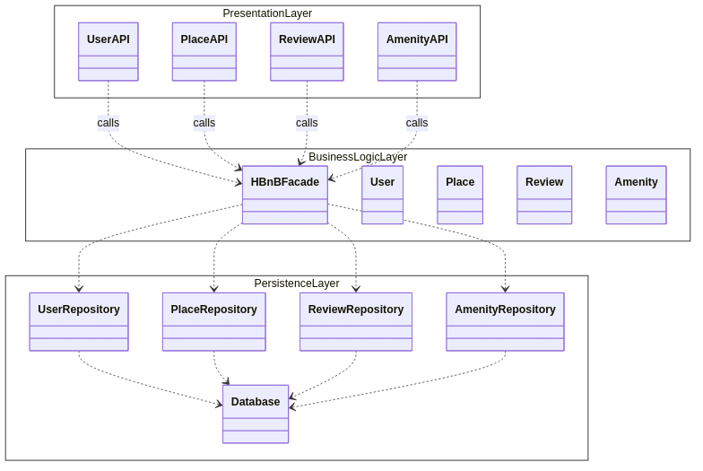
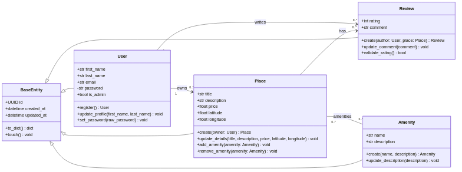
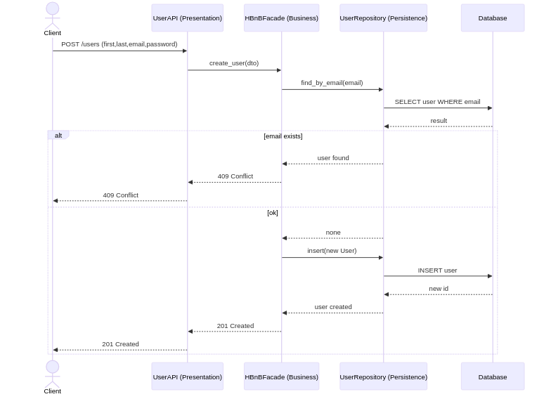
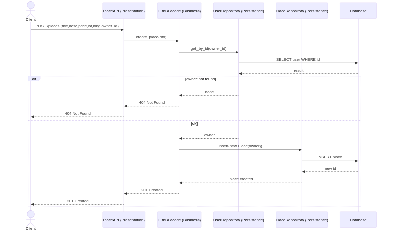
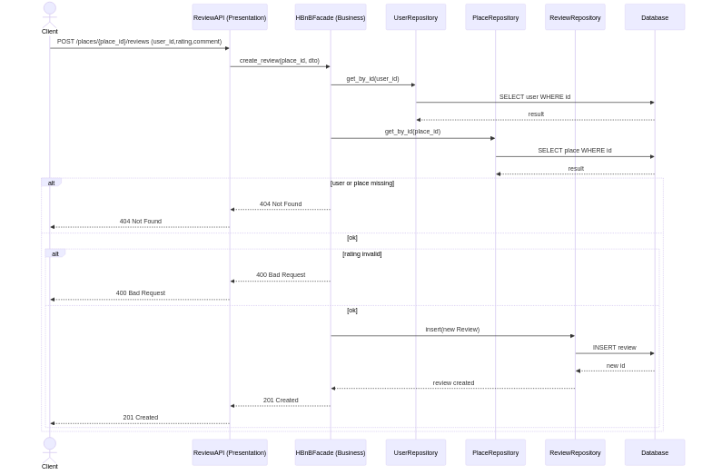
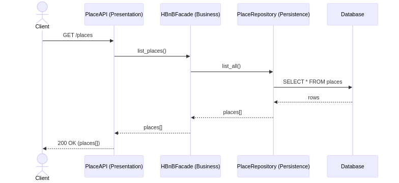

# HBnB Part 1 UML

This folder contains the UML diagrams for the HBnB project and the script to regenerate PNG exports.

## Business rules summary

- Users can register, authenticate, and manage their profiles.
- Users can create places and list or search existing places.
- Reviews can be submitted for places by authenticated users.

## Task 0 notes (layers and facade)

- Presentation layer: Handles user input and exposes API endpoints.
- Business layer: Holds core domain logic, validation, and coordination of use cases.
- Persistence layer: Stores and retrieves data using repositories or data mappers.
- Facade: Provides a single entry point from the presentation layer into the business layer, shielding controllers from internal complexity.

## Diagrams (PNG)




## Task 1 Notes (Business Logic Class Diagram)

- BaseEntity: shared `id`, `created_at`, `updated_at` with `to_dict` and `touch` for serialization and timestamp updates.
- User: identity and access fields (`first_name`, `last_name`, `email`, `password`, `is_admin`) with `register`, `update_profile`, `set_password`.
- Place: listing fields (`title`, `description`, `price`, `latitude`, `longitude`) with `create`, `update_details`, `add_amenity`, `remove_amenity`.
- Review: feedback fields (`rating`, `comment`) with `create`, `update_comment`, `validate_rating`.
- Amenity: catalog fields (`name`, `description`) with `create`, `update_description`.

Relationship notes:

- User owns Places.
- Place has Reviews.
- User writes Reviews.
- Place has many-to-many Amenities.






## Regenerate PNGs

From the repository root:

```
./part1/regenerate.sh
```
