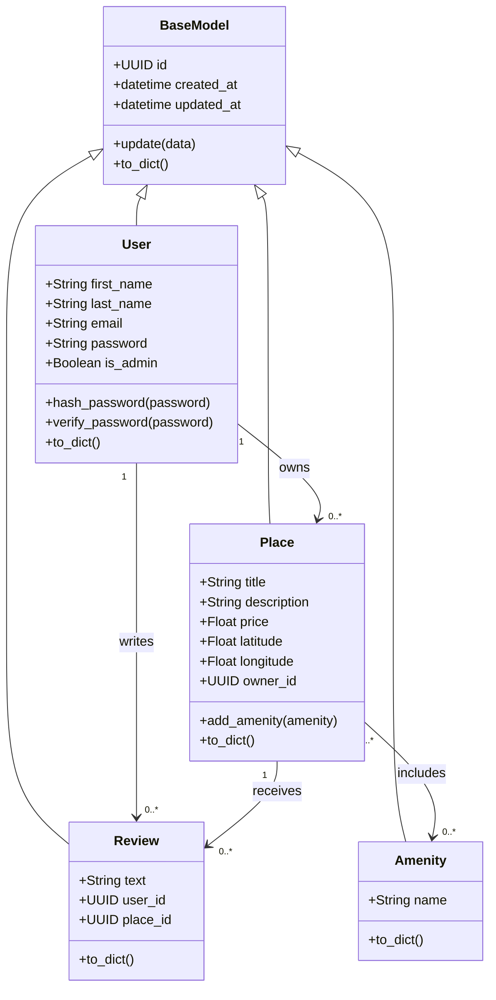

# Detailed Class Diagram for the Business Logic Layer

## Overview

The Business Logic Layer contains the core entities and rules of the
HBnB application.

These entities model the main concepts of the platform and define how
application data is organized and related.

To promote code reuse and maintainability, all entities inherit from a
common `BaseModel` class. This parent class provides shared identifiers,
timestamps, update behavior, and serialization.

---

## Class Diagram



The rendered diagram is also available in:

```text
business-logic-layer.svg
```

---

# Entities

## BaseModel

The `BaseModel` class serves as the abstract parent class for all
business entities.

### Attributes

- `id : UUID`
- `created_at : datetime`
- `updated_at : datetime`

### Methods

- `update(data)`
- `to_dict()`

### Responsibilities

- Generate and store a unique identifier for each entity.
- Record when an entity is created.
- Record when an entity is updated.
- Provide shared attribute-update behavior.
- Provide a common dictionary representation.

---

## User

The `User` entity represents a person who interacts with the
application.

A user may own places, write reviews, authenticate with a password, and
hold administrator privileges.

### Attributes

- `first_name : String`
- `last_name : String`
- `email : String`
- `password : String`
- `is_admin : Boolean`

### Methods

- `hash_password(password)`
- `verify_password(password)`
- `to_dict()`

### Responsibilities

- Store user profile information.
- Store a unique email address.
- Store a hashed password rather than plain-text credentials.
- Own zero or more places.
- Write zero or more reviews.
- Access privileged operations when marked as an administrator.

### Validation Rules

- First name must not be empty.
- Last name must not be empty.
- Email must be valid and unique.
- Password must not be empty.
- Passwords must be hashed before persistence.
- Administrator status must be a Boolean value.

---

## Place

The `Place` entity represents a property listed on the platform.

Each place belongs to one user and may be associated with multiple
reviews and amenities.

### Attributes

- `title : String`
- `description : String`
- `price : Float`
- `latitude : Float`
- `longitude : Float`
- `owner_id : UUID`

### Methods

- `add_amenity(amenity)`
- `to_dict()`

### Responsibilities

- Store property information.
- Reference the user who owns the property.
- Associate amenities with the property.
- Receive reviews written by users.

### Validation Rules

- Title must not be empty.
- Description must be valid text.
- Price must be greater than zero.
- Latitude must be between `-90` and `90`.
- Longitude must be between `-180` and `180`.
- The owner must reference an existing user.
- Duplicate amenity associations must be prevented.

---

## Review

The `Review` entity represents textual feedback written by a user about
a place.

### Attributes

- `text : String`
- `user_id : UUID`
- `place_id : UUID`

### Methods

- `to_dict()`

### Responsibilities

- Store textual feedback.
- Reference the user who wrote the review.
- Reference the place being reviewed.
- Preserve the author and place association after creation.

### Validation Rules

- Review text must not be empty.
- The author must reference an existing user.
- The reviewed place must exist.
- A user may submit only one review for the same place.
- Review ownership must not be changed through an update.

---

## Amenity

The `Amenity` entity represents a service or feature available at a
place.

Examples include:

- WiFi
- Parking
- Swimming pool
- Air conditioning

### Attributes

- `name : String`

### Methods

- `to_dict()`

### Responsibilities

- Describe a property feature or service.
- Be associated with zero or more places.
- Maintain a unique name.

### Validation Rules

- Name must not be empty.
- Name must be unique.
- Duplicate associations with the same place must be prevented.

---

# Inheritance

All primary entities inherit from `BaseModel`.

```text
BaseModel
├── User
├── Place
├── Review
└── Amenity
```

This inheritance relationship ensures that every entity receives:

- A unique identifier
- A creation timestamp
- An update timestamp
- Common update behavior
- Common serialization behavior

---

# Relationships Between Entities

## User and Place

A user can own zero or many places, while each place belongs to exactly
one user.

### Multiplicity

```text
User 1 -------- 0..* Place
```

### Meaning

- One user may have no listed properties.
- One user may own several properties.
- A place cannot exist without one owner.
- A place cannot have multiple owners.

---

## User and Review

A user can write zero or many reviews, while each review is written by
exactly one user.

### Multiplicity

```text
User 1 -------- 0..* Review
```

### Meaning

- A user may never write a review.
- A user may write reviews for several places.
- Every review must have one author.
- Review authorship cannot be shared by multiple users.

---

## Place and Review

A place can receive zero or many reviews, while each review belongs to
exactly one place.

### Multiplicity

```text
Place 1 -------- 0..* Review
```

### Meaning

- A new place may have no reviews.
- A place may receive multiple reviews.
- Every review must reference one place.
- A review cannot describe multiple places.

---

## Place and Amenity

A place can include zero or many amenities, and an amenity can belong to
zero or many places.

### Multiplicity

```text
Place 0..* -------- 0..* Amenity
```

### Meaning

- A place may have no amenities.
- A place may include several amenities.
- The same amenity may be shared by many places.
- A many-to-many association is required between places and amenities.

---

# Entity Relationship Summary

| Source | Relationship | Target | Multiplicity |
|---|---|---|---|
| `BaseModel` | Parent of | `User` | Inheritance |
| `BaseModel` | Parent of | `Place` | Inheritance |
| `BaseModel` | Parent of | `Review` | Inheritance |
| `BaseModel` | Parent of | `Amenity` | Inheritance |
| `User` | Owns | `Place` | One-to-many |
| `User` | Writes | `Review` | One-to-many |
| `Place` | Receives | `Review` | One-to-many |
| `Place` | Includes | `Amenity` | Many-to-many |

---

# Business Rules

The business layer enforces the following rules:

1. Every entity has a unique identifier.
2. Every entity records creation and update timestamps.
3. User email addresses must be unique.
4. Passwords must be securely hashed.
5. Every place must have one valid owner.
6. Every review must reference one valid user and one valid place.
7. A user may review a particular place only once.
8. Place ownership cannot be changed through ordinary updates.
9. Review ownership and place association cannot be changed through
   ordinary updates.
10. Amenity names must be unique.
11. A place cannot contain the same amenity more than once.
12. Invalid coordinates and prices must be rejected.

---

# Role of the Business Logic Layer

The Business Logic Layer sits between the presentation layer and the
persistence layer.

```text
Presentation / API Layer
           |
           v
Business Logic Layer
           |
           v
Persistence Layer
```

Its responsibilities include:

- Creating domain objects
- Validating business rules
- Managing entity relationships
- Preventing invalid state changes
- Coordinating persistence through repositories
- Returning domain data to the API layer

The API layer should not access database storage directly. Instead, it
communicates through the facade, which coordinates business objects and
repositories.

---

# Design Benefits

This class design provides the following benefits:

## Reusability

Shared behavior is implemented once in `BaseModel` and reused by all
entities.

## Separation of Concerns

Each entity is responsible for its own state and business behavior,
while persistence is handled separately.

## Maintainability

Clear classes and relationships make future changes easier to
understand and implement.

## Testability

Models and business rules can be tested independently from HTTP routes
and database implementations.

## Extensibility

New fields, validation rules, entities, or relationships can be added
without redesigning the entire application.

---

# Conclusion

The Business Logic Layer defines the central structure of the HBnB
application.

The `User`, `Place`, `Review`, and `Amenity` entities inherit common
behavior from `BaseModel` and interact through clearly defined
one-to-many and many-to-many relationships.

This design supports the facade and repository patterns used in the
later implementation stages while keeping business rules separate from
the API and persistence layers.
