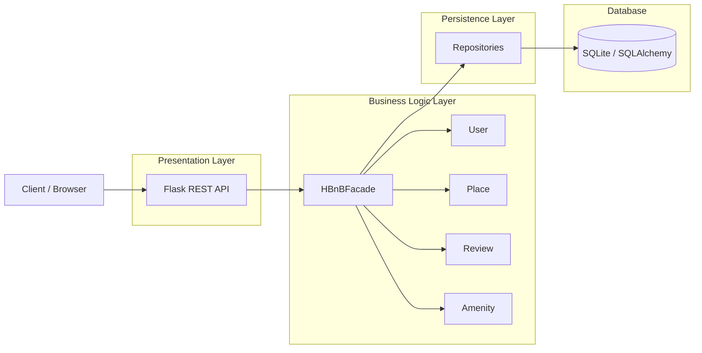

# High-Level Package Diagram

## Overview

The HBnB application follows a layered architecture that separates responsibilities into four main layers:

- Presentation Layer
- Business Logic Layer
- Persistence Layer
- Database

This separation improves maintainability, scalability, and testability.

---

## Architecture Diagram

---

# Layer Responsibilities

## Presentation Layer

The presentation layer exposes REST endpoints using Flask-RESTX.

Its responsibilities include:

- Receiving HTTP requests
- Validating request data
- Returning JSON responses
- Authentication using JWT

---

## Business Logic Layer

The business layer contains the application's core entities and business rules.

The `HBnBFacade` coordinates communication between the presentation layer and the persistence layer.

---

## Persistence Layer

The persistence layer is responsible for storing and retrieving application data.

Each entity has a dedicated repository:

- UserRepository
- PlaceRepository
- ReviewRepository
- AmenityRepository

Repositories interact with SQLAlchemy instead of directly manipulating the database.

---

## Database Layer

The database stores persistent application data.

SQLAlchemy maps Python objects to relational tables including:

- users
- places
- reviews
- amenities
- place_amenity

---

# Benefits

This architecture provides:

- Separation of concerns
- Easier testing
- Better maintainability
- Improved scalability
- Independent evolution of each layer
