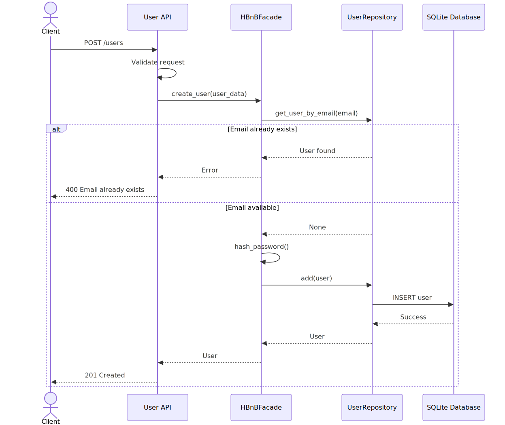
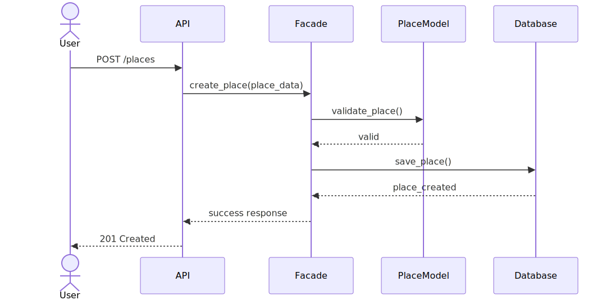
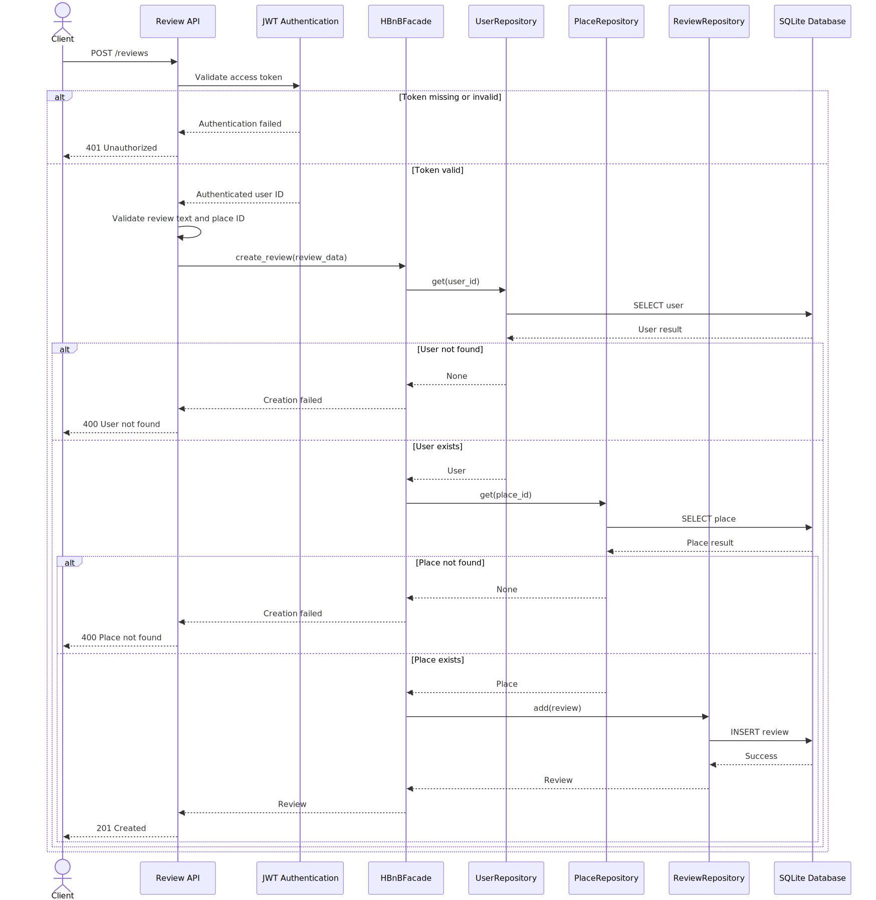
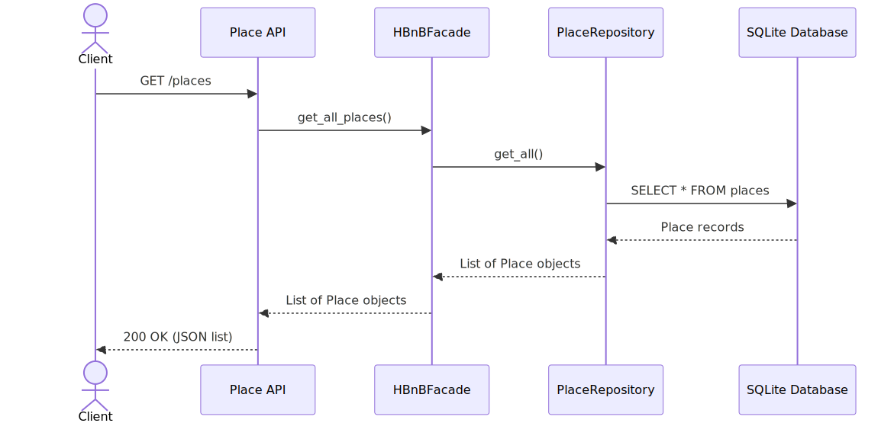

# HBnB Evolution – Technical Documentation

## Introduction

This document provides the technical design and architecture for the **HBnB Evolution** application.

The purpose of this documentation is to serve as a blueprint for the implementation phases of the project by defining:

* The overall system architecture
* The business logic layer design
* The interactions between application layers
* The flow of information during API requests

The application follows a layered architecture composed of:

1. Presentation Layer
2. Business Logic Layer
3. Persistence Layer

The documentation includes UML diagrams created with Mermaid.js and explanatory notes describing the design decisions and relationships between system components.

---

# 1. High-Level Architecture

## Package Diagram

### Source Diagram

[View High-Level Package Diagram](./high-level-diagram.mmd)

### Rendered Diagram



---

## Overview

The HBnB application follows a three-layer architecture:

### Presentation Layer

Responsible for handling user interactions and exposing REST API endpoints.

Components:

* API Endpoints
* Services
* Controllers

Responsibilities:

* Receive requests
* Validate input
* Return responses

---

### Business Logic Layer

Contains the application's core domain models and business rules.

Components:

* User
* Place
* Review
* Amenity
* HBnBFacade

Responsibilities:

* Process business operations
* Validate domain rules
* Coordinate interactions between entities

---

### Persistence Layer

Responsible for storing and retrieving application data.

Components:

* Repository Layer
* Database

Responsibilities:

* Data persistence
* Data retrieval
* Database communication

---

## Facade Pattern

The system uses the **Facade Pattern** through the `HBnBFacade` component.

Benefits:

* Simplifies communication between layers
* Reduces coupling
* Centralizes business operations
* Provides a single entry point for application services

Communication Flow:

```text
Presentation Layer
        ↓
    HBnBFacade
        ↓
 Business Logic
        ↓
 Persistence Layer
```

---

# 2. Business Logic Layer

## Class Diagram

### Source Diagram

[View Business Logic Diagram](./business-logic-layer.mmd)

### Rendered Diagram



---

## BaseModel

### Purpose

Provides common attributes shared by all entities.

### Attributes

* id : UUID
* created_at : datetime
* updated_at : datetime

### Methods

* save()
* update()

---

## User

### Purpose

Represents a platform user.

### Attributes

* first_name
* last_name
* email
* password
* is_admin

### Methods

* create()
* update()
* delete()

---

## Place

### Purpose

Represents a property listed on the platform.

### Attributes

* title
* description
* price
* latitude
* longitude

### Methods

* create()
* update()
* delete()

### Relationships

* Owned by one User
* Contains many Reviews
* Associated with many Amenities

---

## Review

### Purpose

Represents user feedback for a place.

### Attributes

* rating
* comment

### Methods

* create()
* update()
* delete()

### Relationships

* Written by one User
* Associated with one Place

---

## Amenity

### Purpose

Represents a service or feature available in a place.

### Attributes

* name
* description

### Methods

* create()
* update()
* delete()

### Relationships

* Can belong to multiple Places

---

## Entity Relationships

### Inheritance

All entities inherit from BaseModel:

```text
BaseModel
 ├── User
 ├── Place
 ├── Review
 └── Amenity
```

### Associations

#### User → Place

One user can own multiple places.

Multiplicity:

```text
User (1) ------ (0..*) Place
```

#### User → Review

One user can write multiple reviews.

Multiplicity:

```text
User (1) ------ (0..*) Review
```

#### Place → Review

One place can receive multiple reviews.

Multiplicity:

```text
Place (1) ------ (0..*) Review
```

#### Place ↔ Amenity

Many-to-many relationship.

Multiplicity:

```text
Place (*) ------ (*) Amenity
```

---

# 3. API Interaction Flow

The following sequence diagrams illustrate how information flows through the Presentation, Business Logic, and Persistence layers.

---

## 3.1 User Registration

### Source Diagram

[View User Registration Sequence](./User-Registration-Sequence.mmd)

### Rendered Diagram



### Description

A new user creates an account.

### Flow

1. User sends registration request.
2. API validates input.
3. Facade creates User object.
4. Repository stores user.
5. Database confirms insertion.
6. Success response returned.

---

## 3.2 Place Creation

### Source Diagram

[View Place Creation Sequence](./Place-Creation-Sequence.mmd)

### Rendered Diagram



### Description

A user creates a new property listing.

### Flow

1. User submits place data.
2. API validates request.
3. Facade creates Place object.
4. Repository persists place.
5. Database confirms storage.
6. API returns success response.

---

## 3.3 Review Submission

### Source Diagram

[View Review Submission Sequence](./Review-Submission-Sequence.mmd)

### Rendered Diagram



### Description

A user submits a review for a place.

### Flow

1. User submits review.
2. API validates review data.
3. Facade verifies user and place.
4. Review object is created.
5. Repository stores review.
6. Database confirms insertion.
7. Success response returned.

---

## 3.4 Fetching Places List

### Source Diagram

[View Places List Sequence](./Fetching-Places-List-Sequence.mmd)

### Rendered Diagram



### Description

A user requests a list of places.

### Flow

1. User sends request.
2. API forwards request.
3. Facade queries repository.
4. Repository retrieves places.
5. Database returns results.
6. Facade formats response.
7. API returns list of places.

---

# Conclusion

This documentation defines the architectural foundation of the HBnB Evolution application.

The diagrams collectively provide:

* A high-level architectural overview
* A detailed representation of the business entities
* A visualization of API request processing
* A blueprint for future implementation phases

The layered architecture and facade pattern promote maintainability, scalability, and separation of concerns while ensuring clear communication between components of the system.

