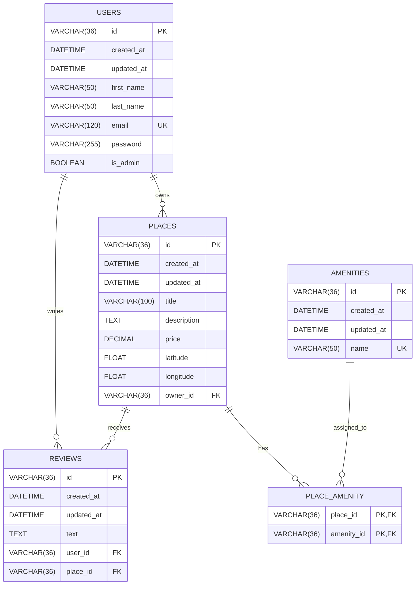

# HBnB Database Entity-Relationship Diagram

This document represents the HBnB relational database schema and the relationships between users, places, reviews, amenities, and the place-amenity association table.

## Relationship Summary

A user can own zero or many places, while each place belongs to exactly one user.

A user can write zero or many reviews, while each review belongs to exactly one user.

A place can receive zero or many reviews, while each review belongs to exactly one place.

Places and amenities have a many-to-many relationship. The `PLACE_AMENITY` association table links places to amenities using a composite primary key containing `place_id` and `amenity_id`.

## Constraints

* Every table uses a UUID string as its primary key.
* User email addresses must be unique.
* Amenity names must be unique.
* Every place must reference an existing user through `owner_id`.
* Every review must reference an existing user and place.
* Each place and amenity combination can appear only once in `PLACE_AMENITY`.

